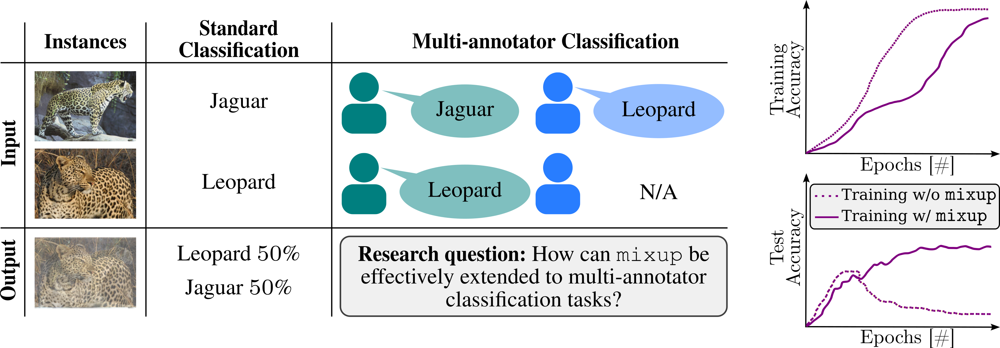
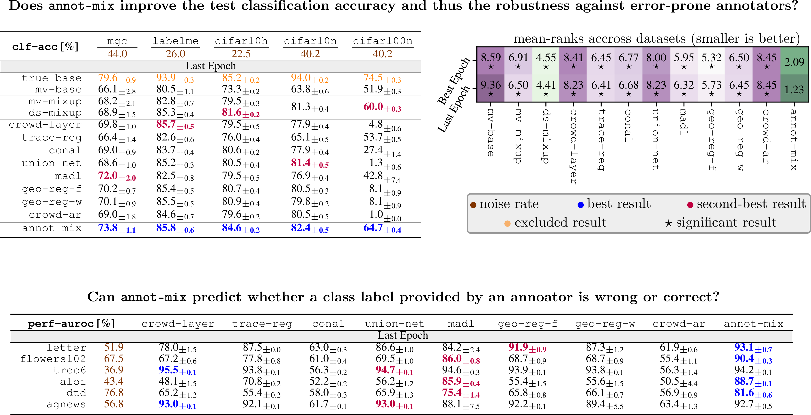

# `annot-mix`: Learning with Noisy Class Labels from Multiple Annotators via a Mixup Extension <br> @ ECAI 2024 :bowl_with_spoon:
<a href="https://ebooks.iospress.nl/doi/10.3233/FAIA240829"></a>
<a href="https://pytorch.org/get-started/locally/"></a>
<a href="https://www.pytorchlightning.ai/"></a>
<a href="https://hydra.cc/"></a>
> Authors: Marek Herde, Lukas Lührs, Denis Huseljic, and Bernhard Sick

This repository provides the code to reproduce all results and the data collection associated with the article of 
the multi-annotator learning approach `annot-mix`. The image below provides an illustration of vanilla `mixup` and 
our research question: In the standard classification tasks (cf. first and second column), `mixup` convexly
combines the two animal images and their class labels. In contrast, multi-annotator classification tasks (cf. first 
and third column) allow multiple class labels to be assigned to a single instance. Further, we know which class label
originates from which annotator, and some class labels may not be available (N/A) from some annotators. Hence, we 
extend `mixup` toward such tasks.
 
<div align="left">
  
</div>

## Setup of Conda Environment  :snake:
As a prerequisite, we assume to have a Linux distribution as operating system. 

1. Download a [`conda`](https://conda.io/projects/conda/en/latest/user-guide/install/index.html) version to be 
   installed on your machine. 
2. Setup the environment via
```bash
projectpath$ conda env create -f environment.yml
```
3. Activate the new environment
```bash
projectpath$ conda activate maml
```
4. Verify that the `maml` (multi-annotator machine learning) environment was installed correctly:
```bash
projectpath$ conda env list
```

## Annotator Simulation :robot: 
As discussed in the associated article, we simulate error-prone annotators for six of the eleven datasets. The
Python script for annotator simulation is [`simulate_annotators.py`](examples/simulate_annotators.py) and the 
corresponding main config file is [`simulation`](/conf/simulation).
1. You need to adjust the paths where to save the datasets and their simulated annotations. For this purpose,
go through all config files in [`data`](conf/data) and [`simulation`](conf/simulation) to adjust the `root` path
according to your preferences.
2. Start the simulation for the six datasets:
```bash
projectpath$ conda activate maml
projectpath/examples$ cd examples
projectpath/examples$ python simulate_annotators.py architecture=tabnet_letter_sim simulation=letter_sim
projectpath/examples$ python simulate_annotators.py architecture=tabnet_aloi_sim simulation=aloi_sim
projectpath/examples$ python simulate_annotators.py architecture=dino simulation=flowers_102_sim
projectpath/examples$ python simulate_annotators.py architecture=dino simulation=dtd_sim
projectpath/examples$ python simulate_annotators.py architecture=bert simulation=trec_6_sim
projectpath/examples$ python simulate_annotators.py architecture=bert simulation=ag_news_sim
```
The simulations may take some time because for each dataset 20 neural networks are trained, each emulating an 
individual, error-prone annotator. For a speedup, you can also modify the `accelerator` parameter in 
[`simulate.yaml`](conf/simulate.yaml).

## Experiments :test_tube:
We leveraged a computer cluster equipped with multiple V100 and A100 GPUs to facilitate a large number of simultaneous
experiments. Access to such a cluster significantly accelerates the reproduction of the results detailed in the 
associated article. The Python script for executing a single experiment is 
[`perform_expiremnt.py`](examples/perform_experiment.py) and the corresponding main config file is 
[`evaluation`](/conf/evaluation.yaml). In this config file, you need also to specify the `mlruns_path` defining
the path, where the results are to be saved via [`mlflow`](https://mlflow.org/). Further, you have the option to
select the 'gpu' or 'cpu' as `accelerator`.
1. Before starting a single experiment, check whether the dataset is already downloaded. For example, if you want
to ensure that the dataset `letter` is downloaded, update the `download` flag in its config file 
[`letter_sim.yaml`](conf/data/letter_sim.yaml).
2. An experiment can then be started by executing the following commands
```bash
projectpath$ conda activate maml
projectpath$ cd examples
projectpath$ python perform_experiment.py data=letter_sim architecture=tabnet_letter_sim seed=0
````
3. Since there are many different experimental configuration including ten repetitions with different seeds, you can
create Bash scripts by following the instructions in [`write_bash_scripts.py`](examples/write_bash_scripts.py) and then
execute the following commands
```bash
projectpath$ conda activate maml
projectpath$ cd examples
projectpath/examples$ python write_bash_scripts
````
4. There is a bash script for each dataset of the benchmark and ablation study. For example, executing the benchmark
experiments for the `letter` dataset via SLURM can be done according to
```bash
projectpath$ conda activate maml
projectpath$ cd examples
projectpath/examples$ sbatch path_to_bash_scripts/letter_sim_benchmark.sh
````

## Results  :bar_chart:
Once, an experiment is completed, its associated results can be loaded via [`mlflow`](https://mlflow.org/). For getting
a tabular presentation of these results, you need to start the Jupyter notebook 
[`tabular_results.ipynb`](examples/tabular_results.ipynb) and follow its instructions.
```bash
projectpath$ conda activate maml
projectpath$ cd examples
projectpath/examples$ jupyter-notebook tabular_results.ipynb
````
Next to loading the results obtained via experiments on your machine, we have included the results from the associated
article as basis for computing the approaches' rankings and performing statistical significance tests. To do so, you 
need to start the Jupyter notebook [`statistical_tests.ipynb`](examples/statistical_tests.ipynb) and 
follow its instructions.
```bash
projectpath$ conda activate maml
projectpath$ cd examples
projectpath/examples$ jupyter-notebook statistical_tests.ipynb
````

A compact summary of the main results is given by the following image.
<div align="left">
  
</div>

## Structure :classical_building:
- [`conf`](/conf): collection of [`hydra`](https://hydra.cc/docs/intro/) config files for defining 
  hyperparameters
  - [`architecture`](/conf/architecture): config group of config files for network architectures
  - [`classifier`](/conf/classifier): config group of config files for multi-annotator classification approaches
  - [`data`](/conf/data): config group of config files for datasets
  - [`simulation`](/conf/simulation): config group of config files to simulate annotators for different datasets
  - [`experiment.yaml`](conf/experiment.yaml): config file to define the architecture, dataset, and multi-annotator
    classification approach for an experiment
  - [`simulate.yaml`](conf/simulate.yaml): config file to define the architecture and dataset for which annotators
    are to be simulated
- [`examples`](/examples): collection of Jupyter notebooks, Python scripts, and Bash scripts required to perform 
  experimental evaluation:
  - [`perform_experiments.py`](/examples/perform_experiment.py): Python script to execute a single experiment
    for a given configuration
  - [`simulate_annotators.py`](examples/simulate_annotators.py): Python script to simulate annotators for a given 
    configuration
  - [`statistical_tests.ipynb`](examples/statistical_tests.ipynb): Jupyter notebook to reproduce statistical tests with
    the results from the associated article
  - [`tabular_results.ipynb`](/examples/tabular_results.ipynb): Jupyter notebook to create the tables of results 
     obtained after executing the experiments
  - [`write_bash_scripts.py`](/examples/write_bash_scripts.py): Python script to create Bash scripts for reproducing
    all experiments
- [`maml`](/maml): Python package for multi-annotator machine learning consisting of several sub-packages
    - [`architectures`](/maml/architectures): implementations of network architectures for the classification and 
      annotator models
    - [`classifiers`](/maml/classifiers): implementations of multi-annotator classification approaches using 
      [`pytorch_lightning`](https://www.pytorchlightning.ai/) modules
    - [`data`](/lfma/data): implementations of [`pytorch`](https://pytorch.org/) data sets with class labels provided
      by multiple, error-prone annotators
    - [`utils`](/lfma/utils): helper functions, e.g., for annotator simulation, mixup, 
      or pre-computation of text embeddings
- [`environment.yml`](environment.yml): file containing all package details to create a 
  [`conda`](https://conda.io/projects/conda/en/latest/) environment

## Citing :books:
If you would like to reference the article of annot-mix, you can use the following `BibTeX` entry:

```
@article{
    herde2024annot,
    title={{`annot-mix`: Learning with Noisy Class Labels from Multiple Annotators via a Mixup Extension }},
    author={Marek Herde and Lukas Lührs and Denis Huseljic and Bernhard Sick},
    booktitle={European Conference on Artificial Intelligence (ECAI)},
    year={2024},
    doi={10.3233/FAIA240829},
}
```