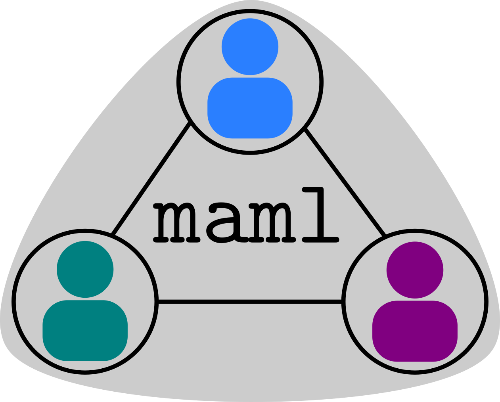
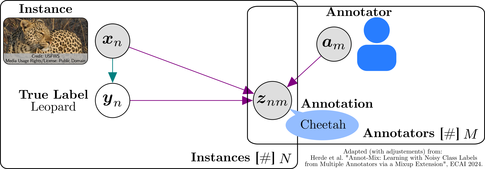

<div align="center">
  
</div>

# `maml`: Multi-annotator Machine Learning
<a href="https://pytorch.org/get-started/locally/"></a>
<a href="https://www.pytorchlightning.ai/"></a>
<a href="https://hydra.cc/"></a>
<a href="https://ebooks.iospress.nl/doi/10.3233/FAIA240829"></a>
<a href="https://openreview.net/forum?id=XOGosbxLrz"></a>

This project implements an ecosystem for multi-annotator learning approaches, which aim at learning from data with
noisy annotations provided by multiple error-prone (mostly human) annotators. This research area is also often 
referred to as learning from crowds or learning from crowd-sourced labels. A graphical model describing this problem
setting is given below.

<div align="left">
  
</div>


## Multi-annotator Learning Approaches

**Multi-annotator learning approaches** estimate annotators' performances for improving neural networks' generalization performances during training:

$$P(y_n, z_{nm} | x_n, a_m) = P(y_n | x_n) \times P(z_{nm} | x_n, a_m, y_n),$$

where

- $P(y_n | x_n)$ represents the class probabilities.
- $Pr(z_{nm} | x_n, a_m, y_n)$ represents the confusion matrix.

The approaches differ in their training and architectures to estimate these two quantities or proxies of them.


| Approach            | Authors            | Venue (Year)              | Annotator Performance Model                      | Training                           |
|---------------------|--------------------|---------------------------|--------------------------------------------------|-------------------------------------|
| `cl`                | Rodrigues et al.   | AAAI (2018)              | noise adaption layer per annotator               | cross-entropy                       |
| `trace-reg`         | Tanno et al.       | CVPR (2019)              | confusion matrix per annotator                   | cross-entropy + regularization       |
| `conal`             | Rodrigues et al.   | AAAI (2021)              | confusion matrix per and across annotators       | cross-entropy + regularization       |
| `union-net`         | Wei et al.         | TNNLS (2022)             | noise adaption layer across annotators           | cross-entropy                       |
| `geo-reg-w`         | Ibrahim et al.     | ICLR (2023)              | confusion matrix per annotator                   | cross-entropy + regularization       |
| `geo-reg-f`         | Ibrahim et al.     | ICLR (2023)              | confusion matrix per annotator                   | cross-entropy + regularization       |
| `madl`              | Herde et al.       | TMLR (2023)              | confusion matrix per instance-annotator pair     | cross-entropy + regularization       |
| `crowd-ar`          | Cao et al.         | SIGIR (2023)             | reliability scalar per instance-annotator pair   | two-model cross-entropy              |
| `annot-mix`         | Herde et al.       | ECAI (2024)              | confusion matrix per instance-annotator pair     | cross-entropy + mixup extension      |

## Structure
- [`data_collection`](data_collection): scripts to emulate or adjust our data collection, including the annotation 
  campaign via LabelStudio
  - [`label_studio_interfaces`](data_collection/label_studio_interfaces): scripts to perform
    an annotation campaign via [Label Studio](https://labelstud.io/) using the example of the dataset 
    [`dopanim`](https://doi.org/10.5281/zenodo.11479590)
    - [`annotation.xml`](data_collection/label_studio_interfaces/annotation.xml): code for the annotation interface
    - [`post-questionnaire.xml`](data_collection/label_studio_interfaces/post-questionnaire.xml): code for the 
      post-questionnaire interface
    - [`pre-questionnaire.xml`](data_collection/label_studio_interfaces/pre-questionnaire.xml): code for the 
      pre-questionnaire interface
  - [`python_scripts`](data_collection/python_scripts): scripts to download task data from [iNaturalist](https://www.inaturalist.org/) and to
    prepare it for annotation via [Label Studio](https://labelstud.io/)
    - [`annotation_tasks.py`](data_collection/python_scripts/annotation_tasks.py): script to create batches of 
      annotation tasks for the upload to [Label Studio](https://labelstud.io/)
    - [`download.py`](data_collection/python_scripts/download.py): script to download data from [iNaturalist](https://www.inaturalist.org/)
    - [`preprocessing.py`](data_collection/python_scripts/preprocessing.py): script to preprocess downloaded data
    - [`taxons.py`](data_collection/python_scripts/taxons.py): contains taxon names and IDs to be downloaded from 
      [iNaturalist](https://www.inaturalist.org/)
- [`empirical_evaluation`](empirical_evaluation): scripts to reproduce or adjust our empirical evaluation, including 
  the benchmark and case studies
  - [`hydra_configs`](empirical_evaluation/hydra_configs): collection of [`hydra`](https://hydra.cc/docs/intro/) config
    files for defining hyperparameters
    - [`architecture`](empirical_evaluation/hydra_configs/architecture): config group of config files for network 
      architectures
    - [`classifier`](empirical_evaluation/hydra_configs/classifier): config group of config files for multi-annotator 
      classification approaches
    - [`data`](empirical_evaluation/hydra_configs/data): config group of config files for datasets
    - [`ssl_model`](empirical_evaluation/hydra_configs/ssl_model): config group of config files for self-supervised learning models as backbones
    - [`experiment.yaml`](empirical_evaluation/hydra_configs/experiment.yaml): config file to define the 
      architecture(s), dataset, and multi-annotator classification approach for an experiment
  - [`jupyter_notebooks`](empirical_evaluation/jupyter_notebooks): Jupyter notebooks to analyze results or use cases
    - [`analyze_collected_data.ipynb`](empirical_evaluation/jupyter_notebooks/analyze_collected_data.ipynb): Jupyter notebook to analyze the dataset 
      [`dopanim`](https://doi.org/10.5281/zenodo.11479590) 
    - [`annotation_times_active_learning.ipynb`](empirical_evaluation/jupyter_notebooks/annotation_times_active_learning.ipynb): Jupyter notebook to reproduce the use case on annotation times in active learning for the dataset 
      [`dopanim`](https://doi.org/10.5281/zenodo.11479590) 
    - [`t_sne_features.ipynb`](empirical_evaluation/jupyter_notebooks/t_sne_features.ipynb): Jupyter notebook to create the *t*-SNE plots of self-supervised features for the dataset 
      [`dopanim`](https://doi.org/10.5281/zenodo.11479590) 
    - [`tabular_results.ipynb`](empirical_evaluation/jupyter_notebooks/tabular_results.ipynb): Jupyter notebook to create the tables of results obtained after executing the 
      experiments for the dataset [`dopanim`](https://doi.org/10.5281/zenodo.11479590) 
  - [`python_scripts`](empirical_evaluation/python_scripts): collection of scripts to perform experimental evaluation
    - [`perform_experiments.py`](empirical_evaluation/python_scripts/perform_experiments.py): script to execute a single experiment for a given configuration
    - [`write_bash_scripts.py`](empirical_evaluation/python_scripts/write_bash_scripts.py): script to write Bash or Slurm scripts for evaluation
- [`maml`](maml): Python package for multi-annotator machine learning consisting of several sub-packages
    - [`architectures`](maml/architectures): implementations of network architectures for the ground truth and 
      annotator performance models
    - [`classifiers`](maml/classifiers): implementations of multi-annotator machine learning approaches using 
      [`pytorch_lightning`](https://www.pytorchlightning.ai/) modules
    - [`data`](maml/data): implementations of [`pytorch`](https://pytorch.org/) data sets with class labels provided by multiple,
      error-prone annotators
    - [`utils`](maml/utils): helper functions, e.g., for visualization
- [`environment.yml`](environment.yml): file containing all package details to create a 
  [`conda`](https://conda.io/projects/conda/en/latest/) environment

## Setup of Conda Environment
As a prerequisite, we assume to have a Linux distribution as operating system. 

1. Download a [`conda`](https://conda.io/projects/conda/en/latest/user-guide/install/index.html) version to be installed on your machine. 
2. Setup the environment via
```bash
projectpath$ conda env create -f environment.yml
```
3. Activate the new environment
```bash
projectpath$ conda activate maml
```
4. Verify that the `maml` (multi-annotator machine learning) environment was installed correctly:
```bash
projectpath$ conda env list
```

## Data Collection
Based on the example of the [`dopanim`](https://doi.org/10.5281/zenodo.11479590) dataset, we provide scripts to 
download task data from [iNaturalist](https://www.inaturalist.org/) and to annotate this data via
[Label Studio](https://labelstud.io/).

1. Check the file [`taxons.py`](data_collection/python_scripts/taxons.py) and ajust the taxon IDs and names according
to your preferences.
2. Inspect the parameters of the script [`download.py`](data_collection/python_scripts/download.py) and adjust them
to your preferences. For example, you can download only one page with 20 observations per class and only 1s per 
request via
```bash
projectpath$ conda activate maml
projectpath$ cd data_collection/python_scripts
projectpath/data_collection/python_scripts$ python download.py --n_pages 1 --per_page 20 --request_time_interval 1
```
Do not use a too small `request_time_interval` to satisfy the requirements of the [iNaturalist](https://www.inaturalist.org/) API.
3. Inspect the parameters of the script [`preprocessing.py`](data_collection/python_scripts/preprocessing.py) and 
adjust them to your preferences. For example, you can define 1 validation and 1 test sample per class via
```bash
projectpath$ conda activate maml
projectpath$ cd data_collection/python_scripts
projectpath/data_collection/python_scripts$ python preprocessing.py --no_of_test_images_per_taxon 1 --no_of_validation_images_per_taxon 1 
```
4. Inspect the parameters of the script [`annotation_tasks.py`](data_collection/python_scripts/annotation_tasks.py) and 
adjust them to your preferences. For example, you can extract the annotation tasks for batch `0` and `1` via
```bash
projectpath$ conda activate maml
projectpath$ cd data_collection/python_scripts
projectpath/data_collection/python_scripts$ python annotation_tasks.py --batches "[0,1]" 
```
The obtained batches can then be uploaded to [Label Studio](https://labelstud.io/) to be manually assigned to certain annotators.
Furthermore, you can upload and employ the corresponding interfaces [`label_studio_interfaces`](data_collection/label_studio_interfaces).
We refer to the documentation of [Label Studio](https://labelstud.io/) for understanding the exact steps of setting up the annotation platform.

## Empirical Evaluation

We provide scripts and Jupyter notebooks to benchmark and visualize multi-annotator machine learning approaches
on datasets annotated by multiple error-prone annotators. 

### Experiments 
The Python script for executing a single experiment is 
[`perform_experiment.py`](empirical_evaluation/python_scripts/perform_experiment.py) and the corresponding main config file 
is [`evaluation`](empirical_evaluation/hydra_configs/evaluation.yaml). In this config file, you also need to specify the `mlruns_path` 
defining the path, where the results are to be saved via [`mlflow`](https://mlflow.org/). Further, you have the option
to select the 'gpu' or 'cpu' as `accelerator`.
1. Before starting a single experiment or Jupyter notebook, check whether the dataset is already downloaded. 
For example, if you want to ensure that the dataset `dopanim` is downloaded, update the `download` flag in its config 
file [`dopanim.yaml`](empirical_evaluation/hydra_configs/data/dopanim.yaml).
2. An experiment can then be started by executing the following commands
```bash
projectpath$ conda activate maml
projectpath$ cd empirical_evaluation/python_scripts
projectpath/empirical_evaluation/python_scripts$ python perform_experiment.py data=dopanim data.class_definition.variant="full" classifier=majority_vote seed=0
````
3. Since there are many different experimental configuration including ten repetitions with different seeds, you can
create Bash scripts by following the instructions in [`write_bash_scripts.py`](empirical_evaluation/python_scripts/write_bash_scripts.py) and then
execute the following commands
```bash
projectpath$ conda activate maml
projectpath$ cd empirical_evaluation/python_scripts
projectpath/empirical_evaluation/python_scripts$ python write_bash_scripts.py
```
4. There is a bash script for the hyperparameter search, each dataset variant of the benchmark and use cases. For 
example, executing the benchmark experiments for the variant `full` via SLURM can be done according to
```bash
projectpath$ conda activate maml
projectpath$ sbatch path_to_bash_scripts/dopanim_benchmark_full.sh
```

### Results
Once, an experiment is completed, its associated results can be loaded via [`mlflow`](https://mlflow.org/). 
For getting a tabular presentation of these results, you need to start the Jupyter notebook 
[`tabular_results.ipynb`](examples/tabular_results.ipynb) and follow its instructions.
```bash
projectpath$ conda activate maml
projectpath$ cd empirical_evaluation/jupyter_notebooks
projectpath/empirical_evaluation/jupyter_notebooks$ jupyter-notebook tabular_results.ipynb
```
For reproducing the confusion matrices of the top-label predictions, reliability diagrams of the likelihoods, and 
histograms of annotation times, you need to start the Jupyter notebook 
[`analyze_collected_data.ipynb`](empirical_evaluation/jupyter_notebooks/analyze_collected_data.ipynb) and follow 
its instructions.
```bash
projectpath$ conda activate maml
projectpath$ cd empirical_evaluation/jupyter_notebooks
projectpath/empirical_evaluation/jupyter_notebooks$ jupyter-notebook analyze_collected_data.ipynb
```
For reproducing the *t*-SNE plot of the self-supervised features learned by the DINOv2 ViT-S/14, you need to start 
the Jupyter notebook [`t_sne_features.ipynb`](empirical_evaluation/jupyter_notebooks/t_sne_features.ipynb) and follow 
its instructions.
```bash
projectpath$ conda activate maml
projectpath$ cd empirical_evaluation/jupyter_notebooks
projectpath/empirical_evaluation/jupyter_notebooks$ jupyter-notebook t_sne_features.ipynb
```
For reproducing the use case study on annotation times in active learning, you need to start 
the Jupyter notebook [`annotation_times_active_learning.ipynb`](empirical_evaluation/jupyter_notebooks/annotation_times_active_learning.ipynb) 
and follow its instructions.
```bash
projectpath$ conda activate maml
projectpath$ cd empirical_evaluation/jupyter_notebooks
projectpath/empirical_evaluation/jupyter_notebooks$ jupyter-notebook annotation_times_active_learning.ipynb
```

## Trouble Shooting
If you encounter any problems, watch out for any `TODO` comments, which give hints or instructions to ensure the 
functionality of the code. If the problems are still not resolved, feel free to create a corresponding GitHub issue
or contact us directly via the e-mail [marek.herde@uni-kassel.de](mailto:marek.herde@uni-kassel.de)
